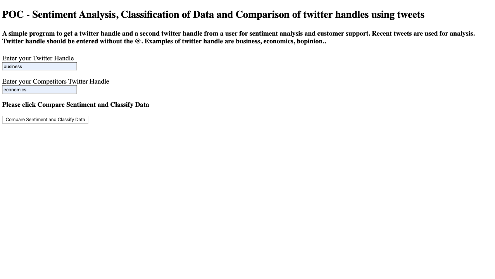
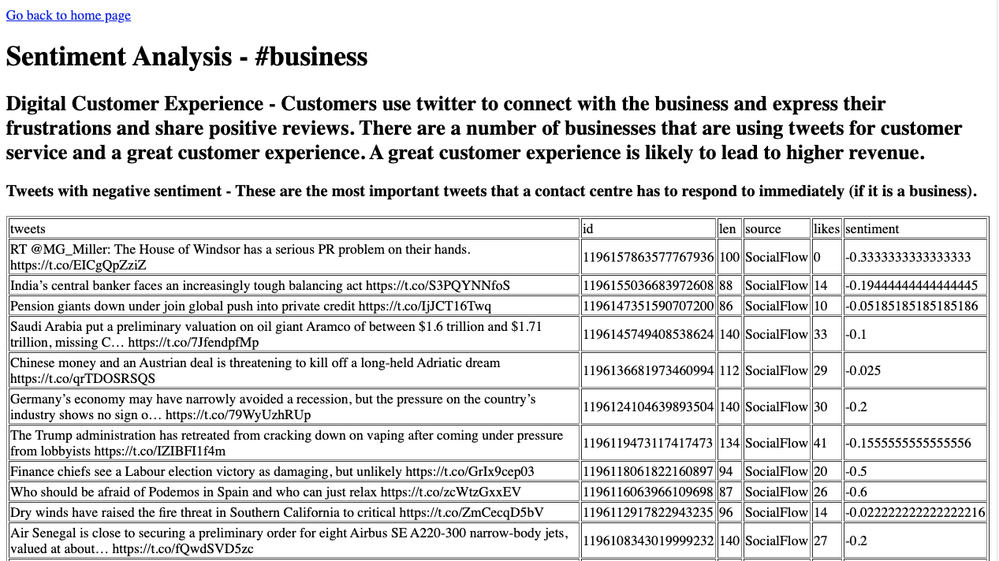
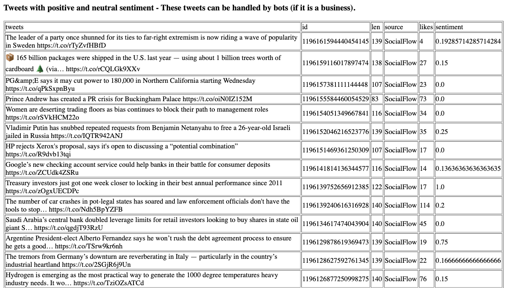
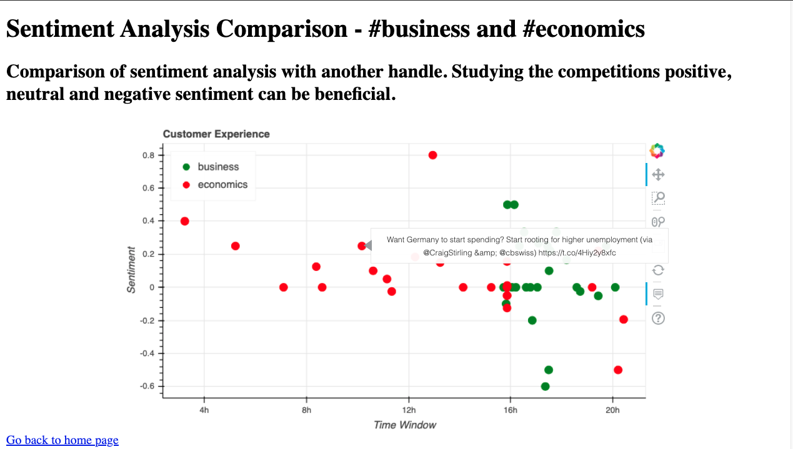
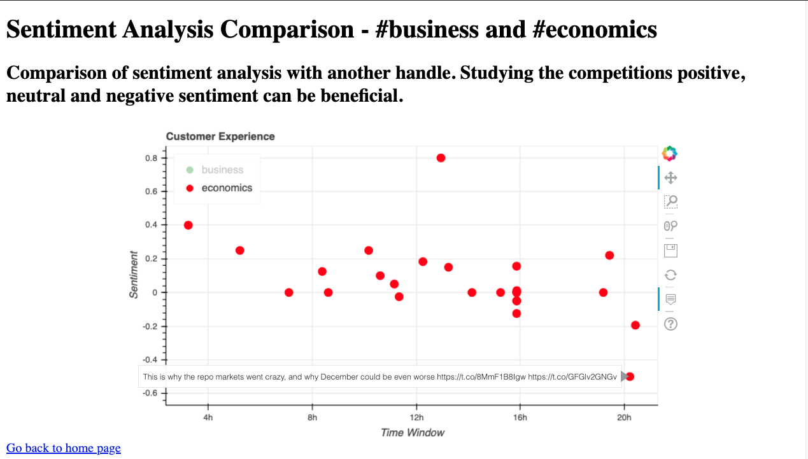

## Customer Experience
Using Python to analyse sentiment of tweets. In case of a business, Tweets can help to understand the customers view of the brand. Acting on Tweets can create a positive sentiment for the brand. Some of the large organisations are using tweets for customer service. 

###This application has some basic html pages. 

###Index Page to enter twitter handles



###Displaying Negative Sentiments on the page



###Displaying Positive Sentiments on the page



###Displaying Plot of Both Twitter Handles



###Displaying Plot of One Twitter Handle



###To run this program, please create a .env file with twitter api keys. The following keys are required.
```#variables with twitter credentials to access Twitter API```

```ACCESS_TOKEN = "###"```
```ACCESS_TOKEN_SECRET = "###" ```
```CONSUMER_KEY = "###"```
```CONSUMER_SECRET = "###"```
```USER_CLEAN_REGEX = "###"```

###Thanks to following people for providing tutorial that made learning easy

TheCodexMe 

LucidProgTuts

CoreyMSchafer