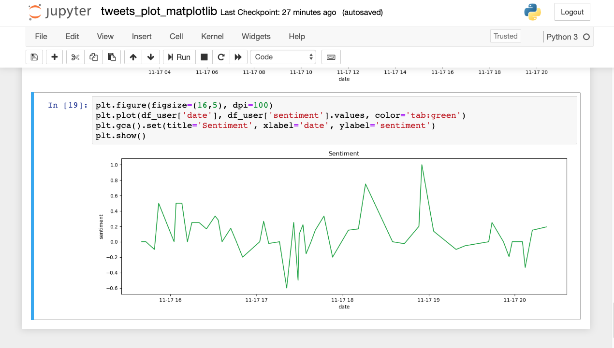

# Customer Experience
Customer Experience is the perception of the business that drives growth formed by the interaction of the customer with the business. Tweets are an excellent way of understanding a customer's perception. One benefit of tweet is that it is an insight into issues of business. The issue can be product, process or technology and some of these issues may need urgent attention. 
Python has packages that can analyse tweets for sentiment. This code is a learning exercise. 
* The code needs polishing.

## This application has some basic html pages. 

## Index Page to enter twitter handles


## Displaying Negative Sentiments on the page


## Displaying Positive Sentiments on the page


## Displaying Plot of Both Twitter Handles


## Displaying Plot of One Twitter Handle


## To run this program, please create a .env file with twitter api keys. The following keys are required.
```#variables with twitter credentials to access Twitter API```

```ACCESS_TOKEN = "###"```
```ACCESS_TOKEN_SECRET = "###" ```
```CONSUMER_KEY = "###"```
```CONSUMER_SECRET = "###"```
```USER_CLEAN_REGEX = "###"```

## A jupyter notebook is included in the package with time series plot using matplotlib.



## Thanks to following people for providing tutorial that made learning easy

TheCodexMe 

LucidProgTuts

CoreyMSchafer
